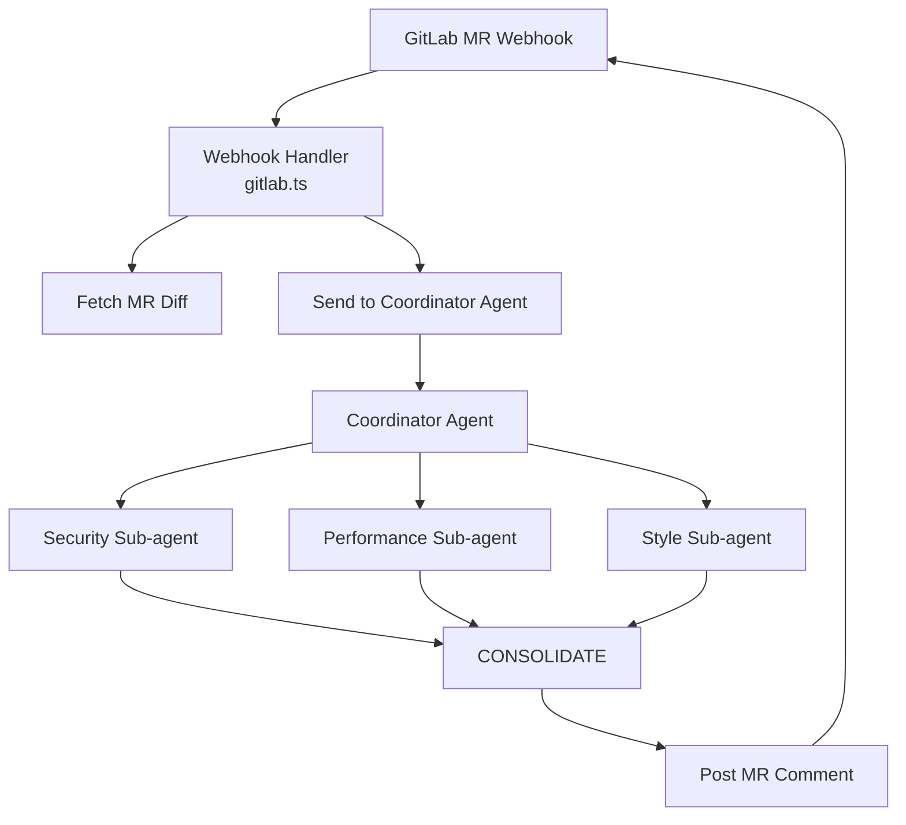

# eve-code-review

> Automated code review for GitLab Merge Requests powered by AI agents.

[](LICENSE)
[](https://eve.dev)

**eve-code-review** is an AI agent that automatically reviews GitLab Merge Requests. When a new MR is opened, it:

1. Fetches the MR diff from GitLab
2. Delegates specialized reviews to three **sub-agents**: Security, Performance, and Code Quality
3. Consolidates the results into a single, structured review comment
4. Posts the review back to the MR as a GitLab note

## Architecture



## Prerequisites

- **Node.js** 24.x or later
- **eve CLI** — install via `npm install -g eve` or use `npx eve`
- A **GitLab** account with API access
- An **OpenAI** API key

## Quick Start

```bash
# Clone the repository
git clone https://github.com/your-username/eve-code-review.git
cd eve-code-review

# Install dependencies
npm install

# Copy and fill in environment variables
cp .env.example .env
# Edit .env with your credentials

# Build the agent
npx eve build

# Start the development server
npx eve dev --port 3000
```

Your agent is now running at `http://localhost:3000`.

### Testing with a webhook

```bash
curl -X POST http://localhost:3000/gitlab/codeReview \
  -H "Content-Type: application/json" \
  -d '{
    "object_kind": "merge_request",
    "object_attributes": {
      "iid": 1,
      "action": "open",
      "target_branch": "develop",
      "title": "Test MR",
      "url": "https://gitlab.com/group/project/-/merge_requests/1"
    },
    "project": { "id": 1 },
    "user": { "name": "Test User" }
  }'
```

## Environment Variables

| Variable | Default | Required | Description |
|---|---|---|---|
| `GITLAB_BASE_URL` | — | ✅ | Your GitLab instance URL (e.g. `https://gitlab.com`) |
| `GITLAB_PRIVATE_TOKEN` | — | ✅ | GitLab Personal Access Token with `api` scope |
| `OPENAI_API_KEY` | — | ✅ | OpenAI API key |
| `REVIEW_TARGET_BRANCH` | `develop` | ❌ | Branch to review. Set to `*` for all branches |
| `REVIEW_ACTIONS` | `open` | ❌ | Comma-separated MR actions to trigger review (e.g. `open,synchronize`) |
| `REVIEW_IGNORE_DRAFT` | `true` | ❌ | Skip MRs with title starting with `WIP:` or `Draft:` |
| `REVIEW_IGNORE_AUTHORS` | _(empty)_ | ❌ | Comma-separated author names to skip (lowercase match) |
| `REVIEW_LANGUAGE` | `English` | ❌ | Language for review feedback (e.g. `English`, `Portuguese`, `Spanish`) |
| `LOG_LEVEL` | `info` | ❌ | Log level: `debug`, `info`, `warn`, `error` |
| `LOG_FORMAT` | `pretty` | ❌ | Set to `json` for structured JSON logging (recommended for production) |
| `NODE_ENV` | — | ❌ | Set to `production` in deployed environments |

## GitLab Webhook Setup

1. Go to your GitLab project → **Settings** → **Webhooks**
2. Add a new webhook:
   - **URL**: `https://your-host.com/gitlab/codeReview`
   - **Trigger**: ☑️ Merge request events
3. Click **Add webhook**

Your agent will now automatically review every new MR.

## Sub-agents

The agent delegates specialized analysis to three sub-agents:

### 🔒 Security
Scans for SQL injection, XSS, auth flaws, exposed secrets, unsafe deserialization, command injection, and other security vulnerabilities.

### ⚡ Performance
Detects N+1 queries, memory leaks, expensive loops, blocking operations, inefficient algorithms, and missing indexes.

### 📐 Code Quality
Reviews naming conventions, code structure, readability, DRY violations, error handling, and adherence to design patterns.

Each sub-agent returns structured JSON (summary, score, findings, positives) which the coordinator consolidates into a single, coherent review comment.

## Deployment

### Vercel (recommended)

The project includes `.vercelignore` and supports Vercel deployment out of the box:

```bash
npm i -g vercel
vercel deploy
```

Set all environment variables in the Vercel dashboard.

### Any Node.js host

Build the agent and start the production server:

```bash
npx eve build
npx eve start --port 3000
```

Make sure all environment variables are set in your hosting environment.

## Development

```bash
# Type-check
npx tsgo

# Build
npx eve build

# Development server with hot reload
npx eve dev --port 3000
```

> **Important**: After adding new files or directories, stop the dev server and clear the build cache:
> ```bash
> rm -rf .eve .workflow-data .output
> npx eve dev --port 3000
> ```

## Project Structure

```
eve-code-review/
├── agent/
│   ├── agent.ts                 # Coordinator agent configuration
│   ├── instructions.md          # Coordinator agent instructions
│   ├── channels/
│   │   ├── eve.ts               # Eve channel (auth)
│   │   └── gitlab.ts            # GitLab webhook handler
│   ├── tools/
│   │   ├── post_mr_comment.ts   # Post review comment to GitLab MR
│   │   └── post_commit_status.ts# Set commit status on GitLab
│   └── subagents/
│       ├── security/
│       │   ├── agent.ts         # Security agent config
│       │   └── instructions.md  # Security review instructions
│       ├── performance/
│       │   ├── agent.ts         # Performance agent config
│       │   └── instructions.md  # Performance review instructions
│       └── style/
│           ├── agent.ts         # Style agent config
│           └── instructions.md  # Code quality review instructions
├── .env.example                 # Environment variables template
├── .gitignore
├── package.json
├── tsconfig.json
└── README.md
```

## License

MIT
